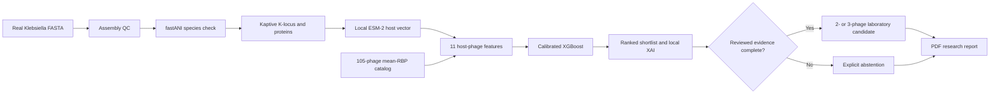

# PHAGE-X three-minute video demo

This runbook is written for the current PHAGE-X interface. It uses the verified
ATCC BAA-2146 assembly, the local ESM-2 checkpoint, and the released XGBoost
artifact. The spoken script is about 390 words, which fits three minutes at a
clear presentation pace.

## Before recording

1. Run `PHAGEX_RUN_REAL_PIPELINE=1 ./scripts/verify.sh` once.
2. Start the app with `./scripts/demo.sh`.
3. Open `http://127.0.0.1:5173` in a clean browser window at 100 percent zoom.
4. Close unrelated tabs and notifications. Record at 1080p or higher.
5. Run the verified FASTA once before recording so the ESM-2 vector is cached.
6. Return to the landing page and place the pointer away from the main heading.

Do not show the synthetic product demonstration as if it were a biological
result. The primary recording path below uses the real uploaded-genome flow.

## Recording script and screen actions

### 0:00 to 0:25 - Problem and product

**Screen:** Start on the hero. Let the DNA animation move for two seconds, then
slowly scroll through the three story sections.

**Say:**

“Drug-resistant Klebsiella infections are difficult to treat, but finding a
bacteriophage for a specific bacterial strain is also difficult. Phages can be
highly strain-specific, so laboratories may need to screen a large catalog
before finding a useful match. PHAGE-X is a research tool that turns a bacterial
genome into an explainable shortlist of phages to test first.”

### 0:25 to 0:50 - Show the pipeline

**Screen:** Pause briefly on Represent, Rank, and Combine. Click **Start
analysis**, then choose **Use my FASTA**.

**Say:**

“The workflow has three parts. First, we represent the bacterial surface using
its capsule locus. Second, we compare that representation with phage
receptor-binding-protein features. Third, we rank candidates and only construct
a combination when the supporting metadata passes the evidence gate.”

### 0:50 to 1:22 - Process a real genome

**Screen:** Click **Load verified K. pneumoniae**, then **Check assembly**,
**Extract K-locus**, and **Generate ESM-2 feature**. Pause after each result.

**Say:**

“I’ll use the included ATCC BAA-2146 Klebsiella assembly. This is a real,
checksum-verified genome, not a typed toy sequence. PHAGE-X validates the
assembly, confirms the species with fastANI, and calls the capsule locus with
Kaptive. Here it identifies KL74 with a 99.62 percent reference match. The
K-locus proteins are then encoded locally by ESM-2 into a 1,280-dimensional host
representation. The uploaded genome is not persisted.”

### 1:22 to 1:55 - Run the compatibility model

**Screen:** Click **Run uploaded-genome XGBoost ranking**. When the results load,
hold on the title and then move to the first three ranked candidates.

**Say:**

“For every host-phage pair, PHAGE-X builds eleven compact features from the host
and phage embeddings. A calibrated XGBoost model scores all 105 catalog phages.
For this isolate, the leading candidates include K65PH164, K34PH164, and S8b.
These scores are prioritization signals. They are not probabilities of cure or
proof that a phage will kill the isolate.”

### 1:55 to 2:22 - Explain the ranking

**Screen:** Expand **Why this candidate ranked here** for the first candidate.
Point to the rationale and local feature-contribution values.

**Say:**

“The result is inspectable. Each candidate shows embedding similarity,
distance, receptor-binding-protein coverage, and the strongest local XGBoost
contributions. This helps a researcher understand why one candidate ranked
above another, while avoiding claims that these statistical features are a
proven biological mechanism.”

### 2:22 to 2:43 - Show the evidence gate

**Screen:** Scroll to **Ranking complete. Combination not issued.** Keep the
blocker text visible.

**Say:**

“PHAGE-X also includes a two- or three-member combination optimizer that rewards
compatibility and receptor or family diversity while penalizing redundancy. In
this repository, the reviewed biological metadata is incomplete, so the system
abstains instead of fabricating a cocktail. That fail-closed behavior is an
important part of the design.”

### 2:43 to 3:00 - Evidence and close

**Screen:** Click **Back**, open **Model validation**, show the evaluation
metrics, then end on the hero or project name.

**Say:**

“On held-out bacterial hosts, the current model reached 0.885 ROC-AUC and 89.5
percent top-five host recall. The next step is prospective plaque-assay testing
and independently reviewed phage metadata. PHAGE-X does not replace the lab. It
helps the lab decide which candidates are worth testing first.”

## On-screen process flow

## Shot checklist

- Hero and moving DNA
- Represent, Rank, and Combine story sections
- Use my FASTA tab
- Verified assembly load
- Assembly pass
- KL74 and 99.62 percent ANI result
- 1,280-dimensional ESM-2 result
- Ranked candidate list
- Expanded local XGBoost explanation
- Reviewed-evidence blocker
- Model-validation metrics
- Final PHAGE-X title

## Editing notes

- Use direct cuts between stages; avoid long cursor travel.
- Keep application audio muted and record narration separately if the room is
  noisy.
- Add short captions for `KL74`, `ESM-2: 1,280 dimensions`, `105 phages`, and
  `Top-5 host recall: 89.5%`.
- Do not add “clinical”, “treatment recommendation”, or “validated cocktail” to
  the title or thumbnail.
- Suggested video title: **PHAGE-X: From Klebsiella Genome to Explainable Phage
  Shortlist**.
